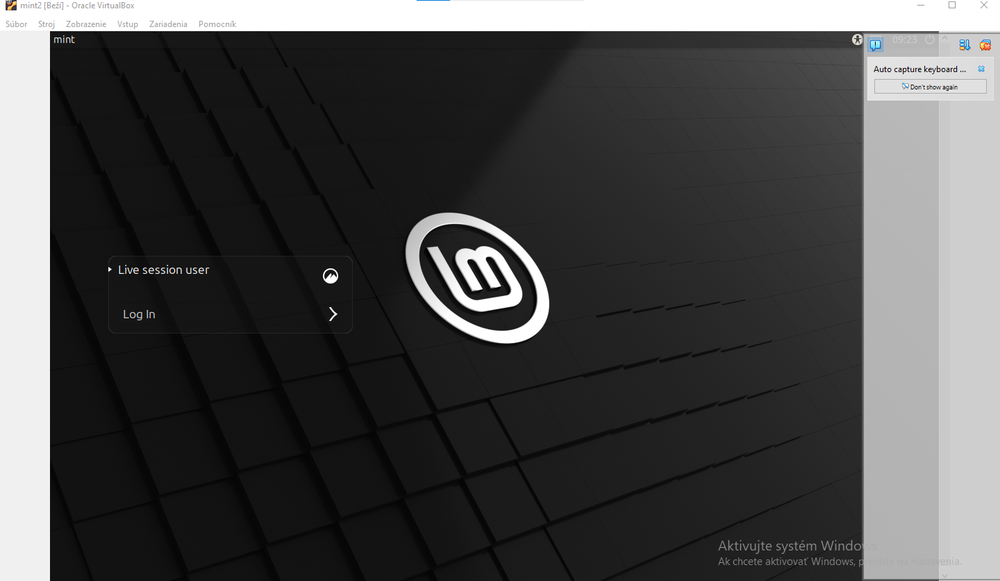
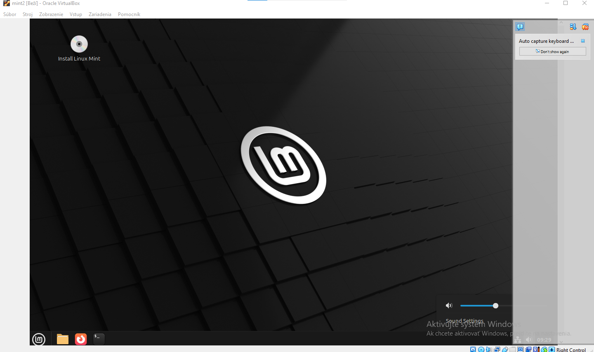

# Cvičenie: Linux — základy, GNU/GPL a distribúcie

> Vyplň odpovede pod každú otázku. Pri otázkach typu áno/nie zaškrtni `- [x]`. Výstupy z terminálu prilep do code blokov.

---

## Úloha 1 — Pojmy GNU a GPL

### 1.1 Rozdiel „free as in freedom" vs. „free as in beer"

**free as in freedom:** - volnost v programe, mozem robit co chcem

**free as in beer:** - zadarmo, nic ma to nestalo 

### 1.2 Čo znamená skratka GPL (celý anglický názov)? - General Public License

### 1.3 Prečo sa Linux niekedy označuje ako „GNU/Linux" a nielen „Linux"?

--- GNU su tie nastroje a linux je jadro a je to spojene

## Úloha 2 — Práca s distrowatch.com

> Otvor v prehliadači **https://distrowatch.com**

### 2.1 Na akej distribúcii je postavený Linux Mint?

> *Tip: klikni na „Linux Mint" v rebríčku → nájdi riadok „Based on".*
 -  based on Debian(stable), Ubuntu(LTS)
### 2.2 Poradie Linux Mint v rebríčku „Page Hit Ranking — Last 6 months"

- **Poradie:** 2
- **Hodnota** (priemerná návštevnosť/deň): 2385

### 2.3 Distribúcia z inej rodiny ako Debian

| Položka | Tvoja odpoveď |
|---|---|
| Názov distribúcie | CachyOS |
| Rodina (Red Hat / Arch / SUSE / iná) | Arch |
| Balíčkovací systém (apt / dnf / pacman / zypper / iný) | pacman |

---

## Úloha 3 — Prihlásenie a odhlásenie

> 1. Menu → **Log Out** (Odhlásiť sa). **Pozor — nie Shut Down!**
> 2. Po odhlásení sa prihlás späť svojimi údajmi.

### 3.1 Aká obrazovka sa zobrazila po odhlásení? Čo si na nej videl?


### 3.2 Bola plocha po opätovnom prihlásení rovnaká, alebo „čistá" (zatvorené všetky okná)?



- [A] rovnaká ako predtým
- [ ] čistá (nové okná)

---

## Úloha 4 — Tri spôsoby spustenia konzoly

### 4.1 Menu → Terminal

Aký je presný názov aplikácie v záhlaví okna? - mint@mint~

### 4.2 Klávesová skratka `Ctrl + Alt + T`

Otvoril sa rovnaký program ako v 4.1?

- [A] áno
- [ ] nie

### 4.3 TTY (`Ctrl + Alt + F3`)

> 1. Stlač `Ctrl + Alt + F3` — uvidíš čierny obraz s textom (TTY).
> 2. Prihlás sa: meno, Enter, heslo (nevidíš ho!), Enter.
> 3. Napíš `exit` + Enter.
> 4. Vráť sa späť do GUI: skús `Ctrl + Alt + F7` (alebo F1, F2).

**Aspoň 2 rozdiely medzi TTY a grafickým terminálom:**

1. tak samozrejme TTY je len "konzola" asi, proste je to len vo forme prikazoveho riadku
2. graficky terminal ma GUI cize ikony atd

**Cez ktoré F-tlačidlo si sa vrátil späť do GUI?**

- [ ] F1
- [ ] F2
- [A] F7
- [ ] iné:

---

## Úloha 5 — Čítanie promptu

### 5.1 Výstupy príkazov

Skopíruj výstup z terminálu sem:

```
$ whoami - mint


$ hostname - mint


$ pwd - /home/mint


$ echo $USER - mint

```

### 5.2 Aký znak je na konci tvojho promptu?

- [A] `$`
- [ ] `#`

### 5.3 Čo tento znak hovorí o tvojich právach v systéme? - ze som bezny pouzivatel

### 5.4 Čítanie promptu

Pozri sa na svoj prompt (príklad: `andrej@mint:~$`). Vypíš, čo všetko z neho vieš prečítať **bez napísania jediného príkazu**:

- hostname 
- meno pouzivatela
- adresar
- typ uctu

---

## Záver

Čo bolo pre teba dnes nové alebo zaujímavé? - Secko